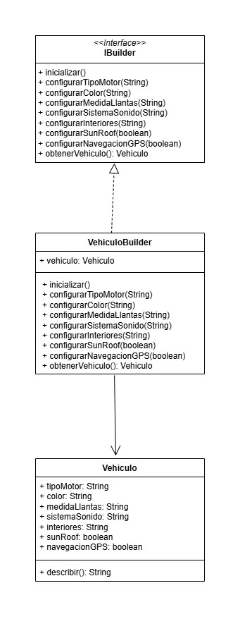

# Trabajo patrones de diseño - Equipo Java

## Escenario 1: Configuración de Automóviles

**Escenario**  
Imagina que estás desarrollando una aplicación para una compañía automotriz que permite a los clientes personalizar y ordenar un automóvil. Un objeto Automóvil puede tener muchas configuraciones opcionales: tipo de motor, color, llantas, sistema de sonido, interiores, techo solar, navegación GPS, etc.

**Problema**  
Crear un objeto Automóvil con múltiples configuraciones puede llevar a constructores con muchos parámetros (el infame "constructor telescópico") o a múltiples constructores sobrecargados, lo que dificulta el mantenimiento y legibilidad del código.

**Solución**  
Se utilizó el patrón **Builder**, que permite construir objetos complejos paso a paso. El patrón nos permite producir distintos tipos y representaciones de un objeto empleando el mismo código de construcción.

---

## Escenario 2: Notificaciones Multiplataforma

**Escenario**
Estás desarrollando una aplicación que gestiona la visualización de notificaciones en diferentes plataformas (por ejemplo: escritorio, móvil, web). Las notificaciones pueden ser de distintos tipos (mensaje, alerta, advertencia, confirmación) y cada tipo puede mostrarse de distintas formas según la plataforma.

**Problema**  
Si usas herencia tradicional, tendrías que crear clases como:

- `NotificacionMensajeWeb`, `NotificacionAlertaWeb`,  
  `NotificacionMensajeMovil`, `NotificacionAlertaMovil`, etc.

Esto lleva rápidamente a una explosión combinatoria de subclases difíciles de mantener.

**Solución**  
Se aplicó el patrón **Bridge**, que permite dividir una clase grande, o un grupo de clases estrechamente relacionadas, en dos jerarquías separadas (abstracción e implementación) que pueden desarrollarse independientemente la una de la otra.

---

## Escenario 3: Sala de Chat Grupal

**Escenario**
Estás desarrollando una aplicación de chat grupal. Los usuarios pueden enviarse mensajes entre sí dentro de una sala de chat. Sin embargo, gestionar las interacciones directas entre cada usuario haría que cada uno deba conocer y comunicarse con todos los demás, lo que resulta en una alta dependencia entre objetos.

**Problema**  
Sin un mediador, cada usuario tendría que mantener referencias directas a todos los demás, lo que genera un sistema difícil de escalar y mantener. Si agregas o eliminas usuarios, debes actualizar muchas relaciones.

**Solución**  
Se utilizó el patrón **Mediator** , que centraliza la comunicación entre los usuarios a través de un objeto mediador. El patrón restringe las comunicaciones directas entre los objetos, forzándolos a colaborar únicamente a través de un objeto mediador.

---
